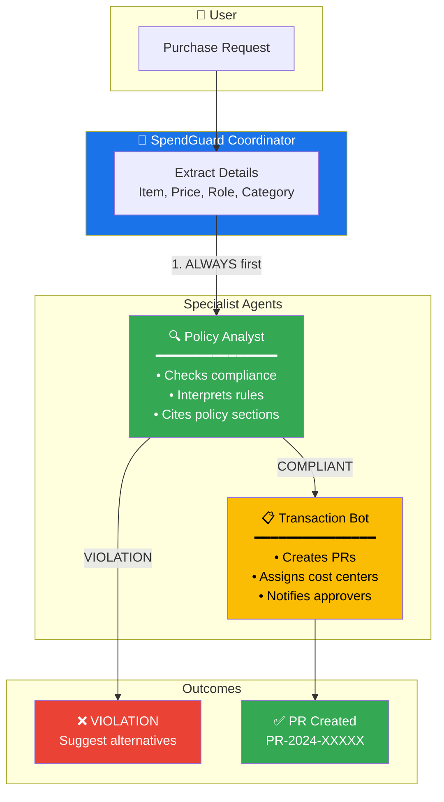

# SpendGuard AI - Architecture Diagram

## Mermaid Diagram (for GitHub/Notion/docs)



## Flow Description

```
┌─────────────────────────────────────────────────────────────────────┐
│                        SpendGuard AI Flow                           │
└─────────────────────────────────────────────────────────────────────┘

    ┌──────────┐
    │   USER   │
    │ Request  │
    └────┬─────┘
         │
         ▼
┌─────────────────────────────────────────────────────────────────────┐
│                    SPENDGUARD COORDINATOR                           │
│  ┌───────────────────────────────────────────────────────────────┐  │
│  │  1. Extract: item, price, requestor role, category            │  │
│  │  2. ALWAYS route to Policy Analyst FIRST                      │  │
│  │  3. Only proceed to Transaction Bot if COMPLIANT              │  │
│  └───────────────────────────────────────────────────────────────┘  │
└─────────────────────────────────────────────────────────────────────┘
         │
         │ Step 1: ALWAYS FIRST
         ▼
┌─────────────────────────────────────────────────────────────────────┐
│                      POLICY ANALYST                                 │
│  ┌───────────────────────────────────────────────────────────────┐  │
│  │  • Checks equipment tiers by role                             │  │
│  │  • Validates spending limits                                  │  │
│  │  • Returns approval thresholds                                │  │
│  │  • Cites specific policy sections                             │  │
│  └───────────────────────────────────────────────────────────────┘  │
└─────────────────────────────────────────────────────────────────────┘
         │
         ├──────────────────────────────────────┐
         │                                      │
         ▼                                      ▼
┌─────────────────────┐              ┌─────────────────────┐
│   ✅ COMPLIANT      │              │   ❌ VIOLATION      │
└─────────┬───────────┘              └─────────┬───────────┘
          │                                    │
          │ Step 2: After approval             │
          ▼                                    ▼
┌─────────────────────────────┐    ┌─────────────────────────────┐
│     TRANSACTION BOT         │    │      STOP & ADVISE          │
│  ┌───────────────────────┐  │    │  ┌───────────────────────┐  │
│  │  • Creates PR         │  │    │  │  • Explain the rule   │  │
│  │  • Assigns vendor     │  │    │  │  • Cite policy section│  │
│  │  • Sets cost center   │  │    │  │  • Suggest alternatives│  │
│  │  • Notifies approver  │  │    │  └───────────────────────┘  │
│  └───────────────────────┘  │    └─────────────────────────────┘
└─────────────┬───────────────┘
              │
              ▼
     ┌─────────────────┐
     │  PR-2024-XXXXX  │
     │  Status: Pending│
     └─────────────────┘
```

## Simple Box Diagram (for slides)

```
┌─────────────────────────────────────────────────────────────────┐
│                                                                 │
│     ┌─────────┐          ┌─────────────────────┐                │
│     │  User   │ ───────▶ │ SpendGuard          │                │
│     │ Request │          │ Coordinator         │                │
│     └─────────┘          └──────────┬──────────┘                │
│                                     │                           │
│                          ┌──────────┴──────────┐                │
│                          │                     │                │
│                          ▼                     │                │
│               ┌─────────────────────┐          │                │
│               │   Policy Analyst    │          │                │
│               │   ─────────────     │          │                │
│               │   ✓ Check limits    │          │                │
│               │   ✓ Cite sections   │          │                │
│               └──────────┬──────────┘          │                │
│                          │                     │                │
│           ┌──────────────┼──────────────┐      │                │
│           │              │              │      │                │
│           ▼              │              ▼      │                │
│    ┌────────────┐        │       ┌────────────┐│                │
│    │ ❌ VIOLATE │        │       │ ✅ COMPLY  ││                │
│    │  Suggest   │        │       └─────┬──────┘│                │
│    │  options   │        │             │       │                │
│    └────────────┘        │             ▼       │                │
│                          │   ┌─────────────────┐                │
│                          │   │ Transaction Bot │                │
│                          │   │ ─────────────── │                │
│                          │   │ Create PR       │                │
│                          │   │ Notify approver │                │
│                          │   └────────┬────────┘                │
│                          │            │                         │
│                          │            ▼                         │
│                          │   ┌─────────────────┐                │
│                          │   │ PR-2024-48327   │                │
│                          │   └─────────────────┘                │
│                                                                 │
└─────────────────────────────────────────────────────────────────┘
```

## Key Innovation: Policy-First Gating

```
BEFORE SpendGuard:           AFTER SpendGuard:
─────────────────────        ─────────────────────

User ──▶ Submit PR           User ──▶ SpendGuard
         │                            │
         ▼                            ▼
    [PR Created]                [Policy Check]
         │                            │
         ▼                       ┌────┴────┐
  [Manual Review]                │         │
         │                       ▼         ▼
    ┌────┴────┐             [COMPLIANT] [VIOLATION]
    │         │                  │         │
    ▼         ▼                  ▼         ▼
[Approved] [Rejected]        [PR Created] [Guided to
    │         │                  │        compliant
    ▼         ▼                  ▼        option]
  [Done]   [Rework]           [Done]

30% rejection rate           <1% rejection rate
```

## Phase 1: Document Intelligence Pipeline (Docling + LangFlow)

```mermaid
flowchart LR
    subgraph DocPipeline["Document Intelligence"]
        PDF["📄 procurement-policy.pdf"]
        DOC["🔍 Docling Parser"]
        CHUNK["📑 Hierarchical Chunker"]
        EMBED["🧮 Embeddings"]
        CHROMA["💾 Chroma Vector Store"]
        RAG["🔎 Semantic Retriever"]
    end

    subgraph ADK["watsonx Orchestrate ADK"]
        TOOL["policy_rag_lookup"]
    end

    subgraph Agent["Policy Analyst"]
        PA["Uses tool for<br/>dynamic policy lookup"]
    end

    PDF --> DOC
    DOC --> CHUNK
    CHUNK --> EMBED
    EMBED --> CHROMA
    CHROMA --> RAG
    RAG --> TOOL
    TOOL --> PA

    style DocPipeline fill:#1a1a3e,stroke:#4facfe
    style ADK fill:#1a73e8,stroke:#fff
    style Agent fill:#34a853,stroke:#fff
```



### Pipeline Components

```
┌─────────────────────────────────────────────────────────────────────┐
│                     DOCLING RAG PIPELINE                            │
└─────────────────────────────────────────────────────────────────────┘

    ┌──────────────────┐
    │ procurement-     │
    │ policy.pdf       │
    └────────┬─────────┘
             │
             ▼
    ┌──────────────────┐
    │    DOCLING       │  ← Parses PDF with table preservation
    │  Document Parser │    Extracts section structure
    └────────┬─────────┘
             │
             ▼
    ┌──────────────────┐
    │   HIERARCHICAL   │  ← Chunks by section (3.1, 3.2, etc.)
    │     CHUNKER      │    Preserves table formatting
    └────────┬─────────┘
             │
             ▼
    ┌──────────────────┐
    │   EMBEDDINGS     │  ← text-embedding-3-small
    │   (OpenAI/wx)    │    1536 dimensions
    └────────┬─────────┘
             │
             ▼
    ┌──────────────────┐
    │  CHROMA VECTOR   │  ← Local persistence
    │      STORE       │    Metadata: section, page, type
    └────────┬─────────┘
             │
             ▼
    ┌──────────────────┐
    │    SEMANTIC      │  ← Top-k retrieval (k=3)
    │    RETRIEVER     │    Cosine similarity
    └────────┬─────────┘
             │
             ▼
    ┌──────────────────┐
    │   ADK TOOL       │  ← Exposes to watsonx Orchestrate
    │ policy_rag_lookup│    Used by Policy Analyst agent
    └──────────────────┘
```

### Sample RAG Query Flow

```
Query: "What is the equipment limit for interns?"

┌─────────────────────────────────────────────────────────────────────┐
│ 1. Policy Analyst receives compliance check request                 │
└───────────────────────────────────┬─────────────────────────────────┘
                                    │
                                    ▼
┌─────────────────────────────────────────────────────────────────────┐
│ 2. Calls policy_rag_lookup(query="equipment limit for interns")    │
└───────────────────────────────────┬─────────────────────────────────┘
                                    │
                                    ▼
┌─────────────────────────────────────────────────────────────────────┐
│ 3. LangFlow retrieves Section 3.2 (Equipment Tiers by Role)        │
│    - Similarity score: 0.92                                         │
│    - Contains: "Intern | $2,000 | Dell Latitude 5400 ($1,200)"     │
└───────────────────────────────────┬─────────────────────────────────┘
                                    │
                                    ▼
┌─────────────────────────────────────────────────────────────────────┐
│ 4. Policy Analyst returns structured response:                      │
│    ✅ Section 3.2: Intern equipment cap is $2,000                   │
│    📋 Standard options: Dell Latitude 5400, MacBook Air M2          │
└─────────────────────────────────────────────────────────────────────┘
```

## Phase 2 Roadmap: Enterprise Data Layer (Cassandra)

```
┌─────────────────────────────────────────────────────────────────────┐
│                   PHASE 2: DATASTAX ASTRA (CASSANDRA)               │
│                   ─────────────────────────────────────             │
│                   IBM acquired DataStax in Feb 2025                 │
└─────────────────────────────────────────────────────────────────────┘

    ┌─────────────────────────────────────────────────────────────┐
    │                     VERSIONED POLICY STORE                   │
    │  ┌───────────────────────────────────────────────────────┐  │
    │  │  policy_versions table                                │  │
    │  │  ─────────────────────                                │  │
    │  │  • version_id (UUID)                                  │  │
    │  │  • effective_date (timestamp)                         │  │
    │  │  • policy_content (text)                              │  │
    │  │  • change_summary (text)                              │  │
    │  └───────────────────────────────────────────────────────┘  │
    └─────────────────────────────────────────────────────────────┘

    ┌─────────────────────────────────────────────────────────────┐
    │                     AUDIT TRAIL                              │
    │  ┌───────────────────────────────────────────────────────┐  │
    │  │  requisition_audit table                              │  │
    │  │  ───────────────────────                              │  │
    │  │  • pr_id (UUID)                                       │  │
    │  │  • timestamp (timestamp)                              │  │
    │  │  • requestor (text)                                   │  │
    │  │  • policy_check_result (text)                         │  │
    │  │  • policy_sections_cited (list<text>)                 │  │
    │  │  • outcome (text)                                     │  │
    │  └───────────────────────────────────────────────────────┘  │
    └─────────────────────────────────────────────────────────────┘

    ┌─────────────────────────────────────────────────────────────┐
    │                     BENEFITS                                 │
    │  ─────────────────────────────────────                      │
    │  • Sub-100ms policy lookups globally                        │
    │  • Immutable audit trail for compliance                     │
    │  • Policy version history for temporal queries              │
    │  • Distributed caching across regions                       │
    └─────────────────────────────────────────────────────────────┘
```
